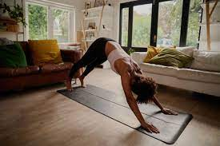
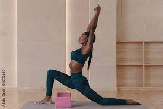
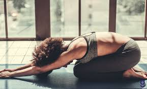
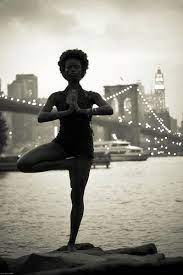

# My Yoga Retreat
# WHAT IS YOGA?
Yoga is a practice that has been around for centuries, and it has many benefits. It can help to relax the mind and body, relieve stress, and increase flexibility. It also helps to build strength and balance.

# WHAT ARE SOME BENEFITS OF YOGA?
Yoga can also be used to help improve balance, posture, and coordination. It can also help to improve concentration and focus.
It can increase your energy levels, reduce fatigue, and help to improve your overall wellbeing. 
Yoga can also help to reduce tension, headaches, and muscle soreness. It can even help to improve your overall mood.
Finally, yoga is a great way to connect with the world around you. It can help to empower you, and give you the strength to take on any challenge.
So, if you’re looking for a way to improve your physical and mental health, then why not give yoga a try?

# WHEN IS IT BEST TO PRACTICE YOGA?
The morning is an ideal time to practice yoga. It can help you start the day with more energy, focus and clarity.
Practicing yoga in the evening can help you relax, unwind and prepare for a good night's sleep.

# GIVE IT A TRY! HERE ARE FOUR SIMPLE POSES THAT YOU AN IMPLEMENT IN YOUR DAY.
1. Downward Dog: This pose is great for stretching the spine, shoulders, and hamstrings. To get into the pose, start in table top position on your hands and knees. Spread your fingers and press firmly into your palms. Straighten your legs and lift your hips up and back, forming an inverted "V" shape. Keep your legs active and press your heels towards the floor, while drawing your navel in towards your spine.

2. Warrior I: This pose is great for building strength and stability in the legs. To get into the pose, come into a standing position with your feet wide apart. Rotate your left foot out 90 degrees and your right foot in 45 degrees. Keep your hips facing forward and bend your left knee so it forms a 90-degree angle. Reach your arms up towards the sky and keep your gaze forward.

3. Child’s Pose: This pose is a great way to relax and reset. To get into the pose, start on your hands and knees and slowly lower your torso down so it rests between your thighs. Place your arms either by your side or stretch them out in front of you. Allow your forehead to rest on the floor and relax your entire body.

4. Tree Pose: This pose is great for improving balance and focus. To get into the pose, start in standing position and shift your weight onto your left foot. Slowly bring your right foot up and place the sole against your inner left thigh. Press your foot into your thigh and raise your arms above your head, bringing your palms together. Gaze forward and hold for a few breaths.

I hope that this information was informing. Namaste.
